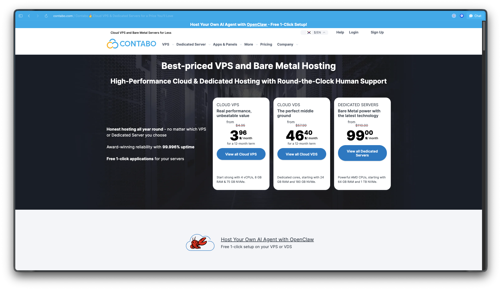
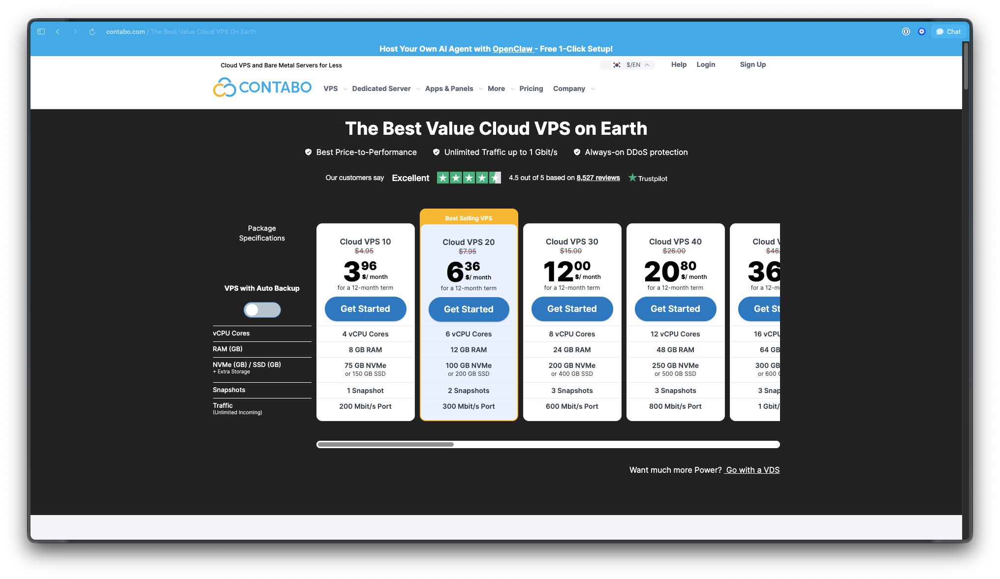
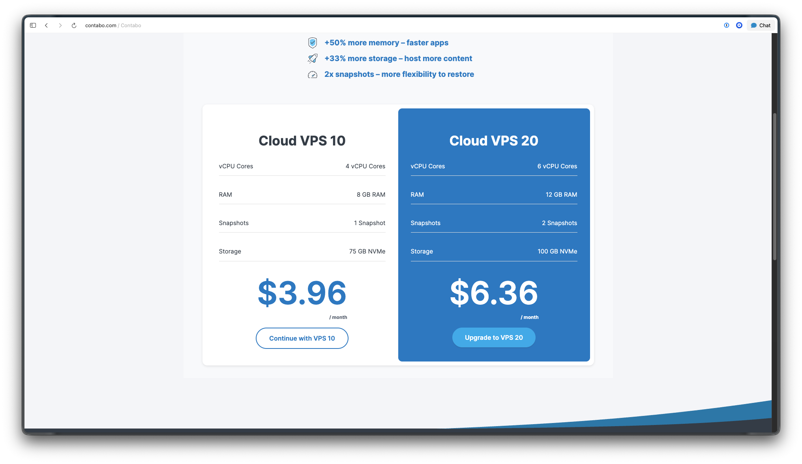
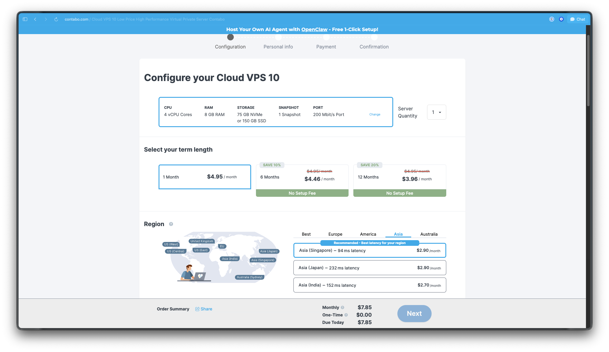
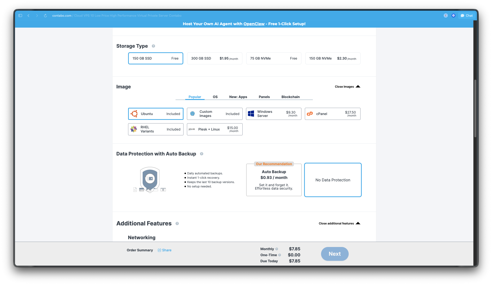
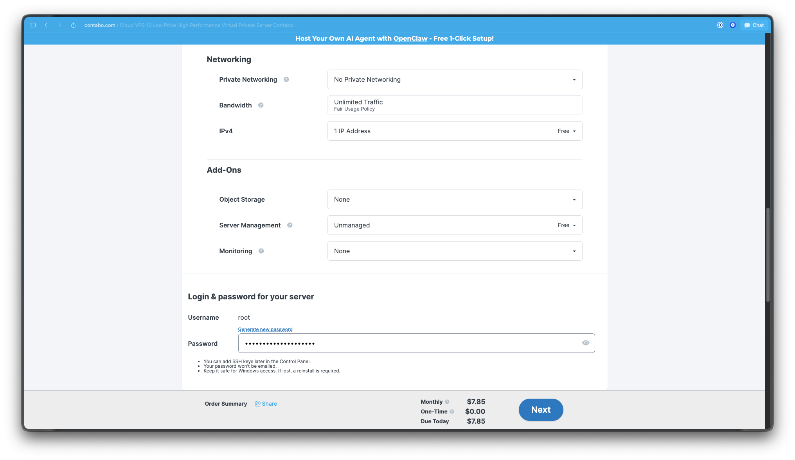
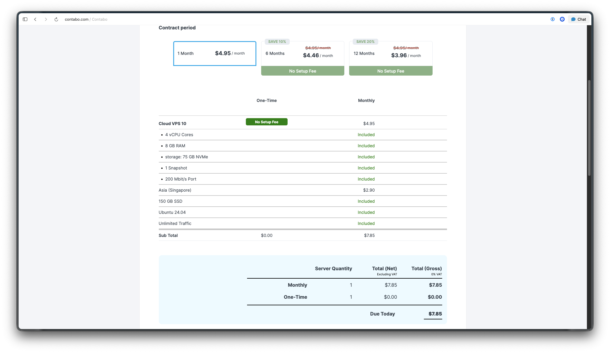
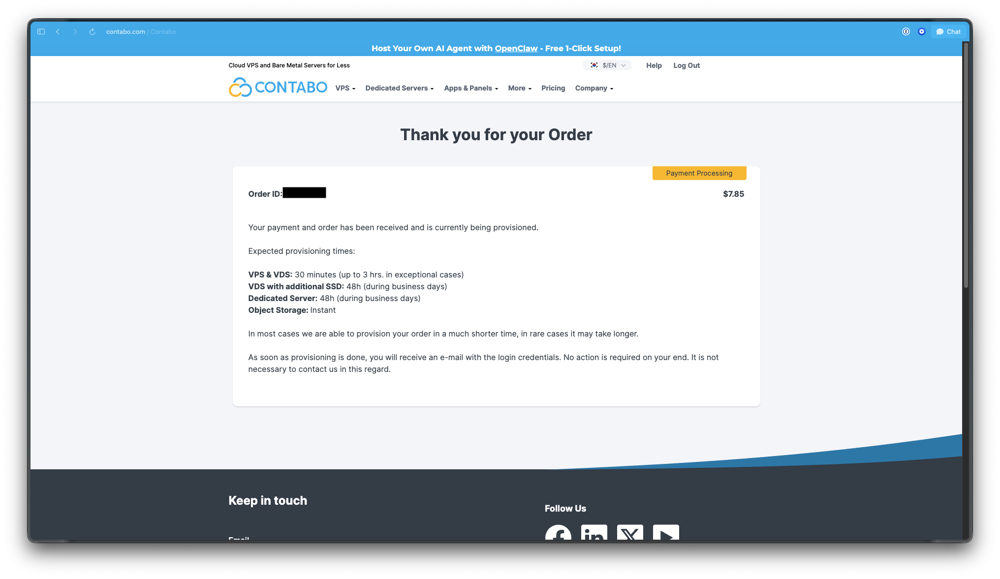
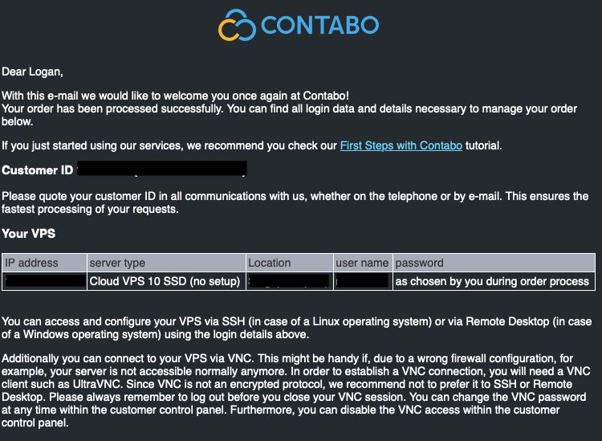
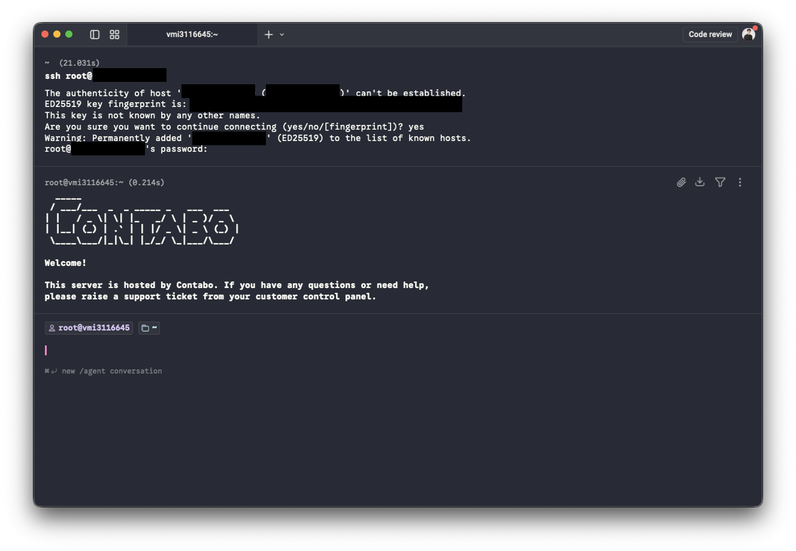

# Contabo VPS 설치 가이드 (OpenClaw용)

이 가이드는 개발 지식이 없어도 따라 할 수 있도록, 필요한 용어를 간단히 설명하면서 정리했습니다.

⚠️ Contabo 화면 구성은 변경될 수 있으므로, 실제 UI가 스크린샷과 다를 수 있습니다.


## 먼저 알아두기 (용어 설명)

- **VPS**: 인터넷으로 빌리는 가상 컴퓨터입니다. 집에서 쓰는 PC처럼 `원격으로 24시간` 실행할 수 있습니다.
- **IP 주소**: VPS로 원격 접속할 때 쓰는 주소입니다. 일종의 집 주소처럼 생각하면 됩니다.
- **SSH**: VPS에 터미널로 안전하게 접속하는 방식입니다.
- **root**: 서버의 기본 관리자 계정입니다. 지금 문서는 가장 간단하게 root로 접속해 진행합니다.
- **CPU / RAM / SSD / NVMe**
  - CPU: 서버의 연산 능력(많을수록 빠름)
  - RAM: 동시에 처리할 수 있는 여유 메모리
  - SSD/NVMe: 저장소 디스크. NVMe가 빠르지만 용량이 더 작습니다.
- **Region(리전)**: 서버를 실제로 물리적으로 두는 지역입니다. 사용자와 가까운 곳일수록 응답이 빠릅니다.
- **SSH 키**: 비밀번호 대신 키 파일로 접속하는 방식(더 안전).

## 1) Contabo 회원가입 및 결제 수단 등록

1. Contabo 웹사이트에 접속해 회원가입을 완료합니다.
2. 결제 수단(카드/결제 가능한 방법)을 등록합니다.

## 2) VPS(Cloud VPS 10) 생성

이미지를 보며 아래 순서로 진행합니다.

1) [Contabo 메인 페이지](https://contabo.com/en/)에서 `View all Cloud VPS` 클릭  
   

2) `Cloud VPS` 목록에서 `Cloud VPS 10`으로 이동  
   

3) `Cloud VPS 10` 선택 (4 vCPU / 8GB RAM / 75GB SSD)  
   

4) 기본 설정 확인 및 구성

- **4.1 사양 선택**: 기간은 1/6/12개월 중 원하는 기간으로 선택(기본 추천은 1개월)  
  - 지역(Region): `Asia` 탭에서 지연시간이 가장 낮은 리전(예: Singapore / India / Japan) 선택  
  

- **4.2 운영체제 및 스토리지**
  - `150 SSD` 또는 `75 NVMe` 중 하나를 선택  
  - 속도만 중요하면 NVMe가 빠르지만 용량은 작습니다. 일반 사용은 SSD 추천
  - `Image`: Ubuntu 선택 (가장 대중적으로 안정적인 리눅스)
  - `Data Protection`: `No Data Protection` 선택  
  

- **4.3 로그인 정보 입력**
  - `username`은 기본 `root`로 둡니다.
  - `password`는 나중에 SSH 접속에 사용하므로 기억하기 쉬우면서도 강한 비밀번호로 설정
  - 네트워크/애드온 설정은 기본값 유지  
  - 참고: 현재 가이드는 비밀번호 방식으로 진행합니다.
  

5) 결제 진행  
   - 가격은 결제 화면 기준 최신 금액을 확인하세요  
   

6) 생성 완료 화면 확인  
   

7) 이메일로 온 VPS 정보 확인
   - 생성 후 `IP 주소`, `username` 정보가 담긴 메일이 도착합니다.
   - SSH 접속은 반드시 이 IP 주소를 사용합니다.
   - 비밀번호는 앞 단계에서 설정한 값 그대로 사용합니다.
   - 메일에서 정보를 찾을 수 없으면 다시 확인해 주세요.
   

## 3) VPS에 SSH로 접속

아래 명령은 공통 형식입니다. `<IP Address>`에는 본인 VPS의 IP를 넣으세요.

```bash
ssh root@<IP Address>
```

### 3-1) macOS / Linux

- 터미널 실행 (Terminal, iTerm, Warp 등)
- 위 명령 실행 후 비밀번호 입력
- 로그인 성공 시 프롬프트가 보이면 접속 완료
- 실패 시:  
  - 비밀번호 재확인 (입력 중 표시는 보이지 않아도 정상)
  - 수신 메일의 IP/로그인 정보를 다시 확인
  


### 3-2) Windows

- Windows에서는 SSH 기능을 먼저 활성화해야 합니다.
  - 공식 가이드: [Install the SSH service on a Windows computer](https://learn.microsoft.com/ko-kr/powershell/scripting/security/remoting/ssh-remoting-in-powershell?view=powershell-7.5#install-the-ssh-service-on-a-windows-computer)
- PowerShell 실행 후 위 `ssh` 명령 실행
- 비밀번호 입력 후, 프롬프트가 보이면 접속 완료
- 접속 실패 시: 비밀번호/메일 정보를 다시 확인

## 4) 보안 강화: SSH 키(선택)

이 가이드는 비밀번호 방식으로 진행합니다.  
비밀번호보다 SSH 키를 쓰면 더 안전하고 편리합니다.

- 개인키는 내 PC에 보관하고, 공개키만 서버에 등록합니다.
- 비밀번호 없이도 로그인되며, 인증 키가 없는 접속은 차단됩니다.
- 실수로 비밀번호가 노출되어도 접속 위험이 낮습니다.

---

*Made by [@ilevk](https://github.com/ilevk) (Based Devrel Ambassador) | Maintained by [Daehan-Base](https://github.com/Daehan-Base)*
